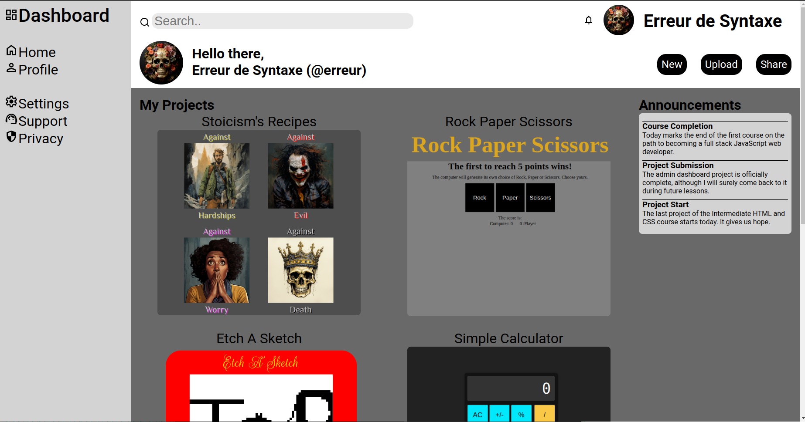

# top-admin-dashboard
An admin dashboard

# Preview

    

# Links

-[Assignment Page (Dec '23)](https://www.theodinproject.com/lessons/node-path-intermediate-html-and-css-admin-dashboard)

-[Finished Project](https://erreurdesyntaxe.github.io/top-admin-dashboard/)

# Notable Features

-CSS Grid  
-Responsive Design  

# Challenges

Layout  
Designing a beautiful page  

# Lessons

Grid is powerful  
Flexbox is still useful  

# Diary

This is the last project of the Intermediate HTML and CSS course of The Odin
Project, Full Stack JavaScript path. I have learned much since starting the
Foundations path, but the feeling of growth has continued throughout the current
course. I look forward to starting the JavaScript course. But first, I need
to start and complete this project.  

I took a quick look at my landing page project, and I remember it was difficult.
Perhaps outside observers can also tell I struggled a lot with Flexbox because
the project looks terrible. I already wanted to go back and fix the README files
to use the current model, but now I want to redo the landing page project from 
zero. It would probably take a very short time, but it's also not worth it right
now. Maybe a later project will require a nice landing page, and I will have 
the justification I need. 

The layout was a catastrophe, so I decided to restart. I wonder if I will start
the layout from scratch again after submitting and reading other students'
code.

My project meets the requirements but looks ugly. I never really paid attention
to aesthetics, design, or appearances, and now I pay the price.